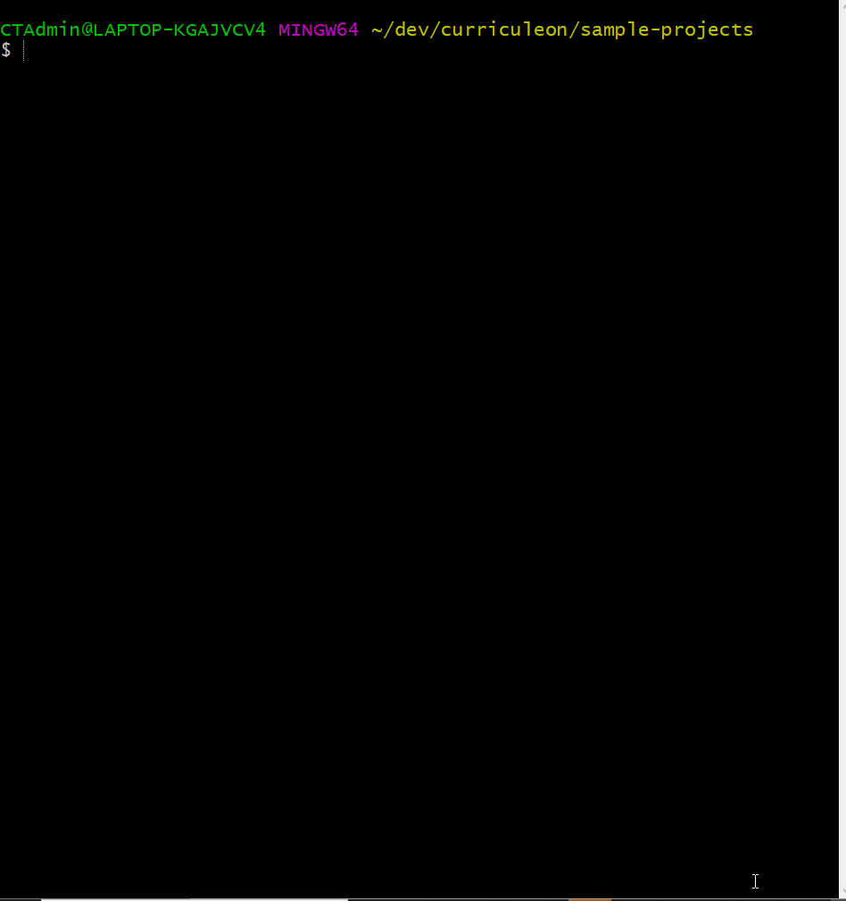

# Sping React Project Template

* **Objective** - To create a product...
* **Purpose** - To gain familiarity the following features...

## How to Run The Application

### Running Web Server
* Open the project from `IntelliJ` using the `pom.xml` located at the root directory of this project.
* Run the `MainApplication.java` to begin the Web Server.
* If your application cannot run because something is occupying a port, use this command with the respective port number specified:
    * **OSX and Linux**
        * ``kill -kill `lsof -t -i tcp:8080` ``
    * **Windows**
        * _For use in command line_:
            * `for /f "tokens=5" %a in ('netstat -aon ^| find ":8080" ^| find "LISTENING"') do taskkill /f /pid %a`
        * _For use in bat-file_:
            * `for /f "tokens=5" %%a in ('netstat -aon ^| find ":8080" ^| find "LISTENING"') do taskkill /f /pid %%a`

#### Testing Web Server via Browser
* From a browser, navigate to `http://localhost:8080/h2-console/` and log into the database.

#### Testing Web Server via Postman
* Launch the [Postman](https://chrome.google.com/webstore/detail/postman/fhbjgbiflinjbdggehcddcbncdddomop?hl=en) app and enter the URI `http://localhost:8080/` and hit Send. 

### Running Web Application
1. ensure you [download NodeJS](https://nodejs.org/en/).
    * The current version can be found here: `https://nodejs.org/en/`
2. Ensure once Node is downloaded, you [add it to your path variable](https://stackoverflow.com/a/27344046)
    * View this stack overflow post for how to modify environment variables
        * `https://stackoverflow.com/a/27344046`
    * For easy access to environment variables in Windows OS, execute the following from the `run` window (`Windows+R`)
        * `rundll32.exe sysdm.cpl,EditEnvironmentVariables`
3. from `Git Bash` navigate to the root directory of this project and execute `cd ./client`.
4. From the `./client` directory, execute `npm install` to install `node_modules`.
5. After installing `node_modules` from `./client`, execute `npm start` to begin serving the Web Application.
6. Navigate to `localhost:3000` to view the Web Application.

## How to Download

#### Part 1 - Forking the Project
* To _fork_ the project, click the `Fork` button located at the top right of the project.

#### Part 2 - Navigating to _forked_ Repository
* Navigate to your github profile to find the _newly forked repository_.
* Copy the URL of the project to the clipboard.

#### Part 3 - Cloning _forked_ repository
* Clone the repository from **your account** into the `~/dev` directory.
  * if you do not have a `~/dev` directory, make one by executing the following command:
    * `mkdir ~/dev`
  * navigate to the `~/dev` directory by executing the following command:
    * `cd ~/dev`
  * clone the project by executing the following command:
    * `git clone https://github.com/MYUSERNAME/NAMEOFPROJECT`

#### Part 4 - Check Build
* Ensure that the tests run upon opening the project.
    * You should see `Tests Failed: ${number_of_tests} of ${number_of_tests} tests`

## How to Submit

#### Part 1 -  _Pushing_ local changes to remote repository
* from a _terminal_ navigate to the root directory of the _cloned_ project.
* from the root directory of the project, execute the following commands:
    * add all changes
      * `git add .`
    * commit changes to be pushed
      * `git commit -m 'I have added changes'`
    * push changes to your repository
      * `git push -u origin master`

#### Part 2 - Submitting assignment
* from the browser, navigate to the _forked_ project from **your** github account.
* click the `Pull Requests` tab.
* select `New Pull Request`
